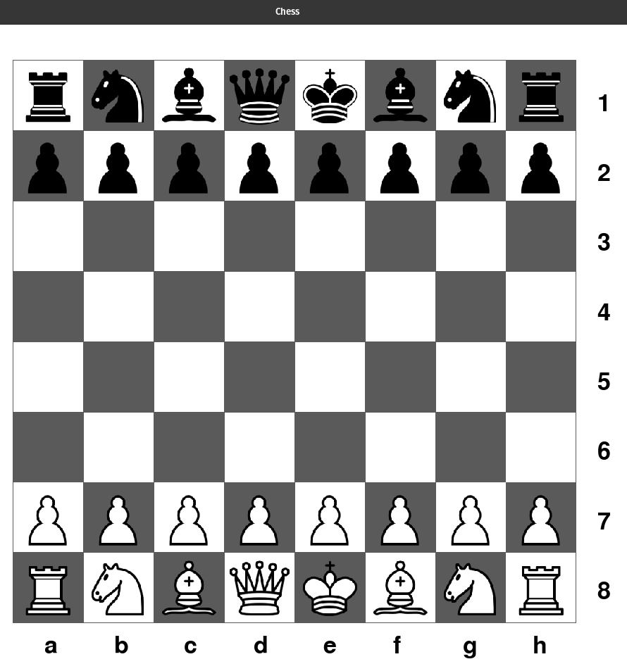
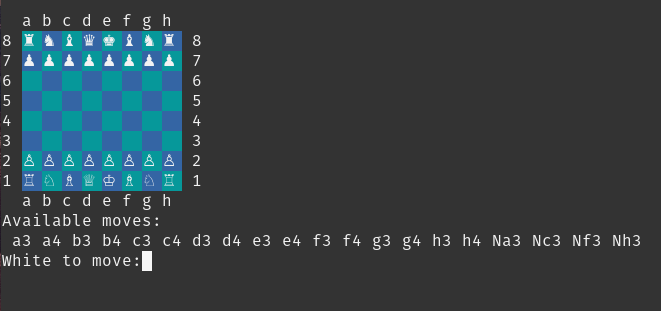

# Chess Game
Complete chess implementation using Python with an ASCII board representation. The program is capabale of handling standard chess notation if reconfigured to take terminal input.
## Pygame interface


## ASCII interface


# Dependencies

Pygame can be installed through pip with:
```
    pip3 install pygame
```

To install pip run:
```
    sudo apt install python3-pip
```
# Execution
```
    python3 chess.py
```
